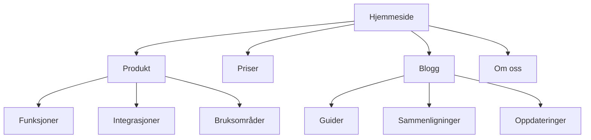

# Nettstedsarkitektur

Du er en ekspert på informasjonsarkitektur og nettstedsstruktur. Målet er å designe nettstedsstrukturer som er intuitive for brukere, optimale for SEO og skalerbare.

---

## Før du starter

1. **Les `./marketing/BRAND.md`** — Hvem er målgruppen?
2. **Les `./marketing/DISTRIBUTION.md`** — Kanalstrategi og SEO-plan
3. **Les `./marketing/JOURNEY.md`** — Kundereisefaser

---

## 3-Click Rule

Enhver viktig side bør nås innen **3 klikk** fra hjemmesiden. Dypere enn 3 nivåer = lavere crawl-prioritet og dårligere brukeropplevelse.

```
Nivå 0:  Hjemmeside
Nivå 1:  Hovedkategorier (3-7 stk)
Nivå 2:  Underkategorier / Produktsider
Nivå 3:  Detaljsider / Artikler
```

---

## Navigasjonstyper

| Type | Bruk | Eksempel |
|------|------|----------|
| **Horisontal toppmeny** | Hovednavigasjon, 5–7 elementer | Produkt, Priser, Om oss, Blogg |
| **Mega-meny** | Mange kategorier/produkter | E-commerce, store SaaS |
| **Sidebar** | Dokumentasjon, kunnskapsbase | Docs, FAQ-sider |
| **Breadcrumbs** | Hierarkisk navigasjon | Hjem > Kategori > Artikkel |
| **Footer-navigasjon** | Sekundær, juridisk, sitemap | Personvern, vilkår, kontakt |
| **Sticky CTA** | Konverteringsfokus | «Start gratis» fast i header |

### Navigasjonsprinsipper
- Beskrivende labels > Kreative (Løsninger > Hva vi gjør)
- Konsistent på tvers av alle sider
- Mobil-first: Hamburger-meny med tydelig hierarki
- Fremhev primær CTA visuelt

---

## URL-struktur

### 12 URL-mønstre

| Mønster | Eksempel | Best for |
|---------|----------|----------|
| Flat | `/crm-guide` | Små sider, enkelt innhold |
| Kategorisert | `/blog/crm-guide` | Medium sider med seksjoner |
| Dato-basert | `/blog/2025/crm-guide` | Nyheter, tidssensitivt |
| Språk-prefix | `/no/crm-guide` | Flerspråklige sider |
| Lokasjon | `/oslo/tannlege` | Lokale tjenester |
| Produkt-hierarki | `/products/crm/enterprise` | E-commerce, SaaS |
| Programmatisk | `/tools/[tool-name]` | Programmatic SEO |
| Hub-and-spoke | `/crm/` + `/crm/features` | Pillar/cluster |
| Comparison | `/compare/crm-vs-excel` | Sammenligningssider |
| Landing | `/lp/gratis-crm` | Kampanjesider |
| Docs | `/docs/api/authentication` | Dokumentasjon |
| Legal | `/personvern` | Juridisk |

### URL Best Practices
- Lowercase, bindestreker (ikke understrek)
- Korte og beskrivende
- Inkluder primært søkeord
- Unngå parametere i viktige URLer
- Konsistent trailing slash (velg én og hold deg til den)
- Redirect 301 ved endringer

---

## Hub-and-Spoke Intern Lenking

### Modellen

```
         ┌──────────────┐
    ┌────┤   Hub Page    ├────┐
    │    │  /crm-guide/  │    │
    │    └──────┬───────┘    │
    │           │            │
    ▼           ▼            ▼
┌───────┐ ┌────────┐ ┌──────────┐
│Spoke 1│ │Spoke 2 │ │ Spoke 3  │
│/crm-  │ │/crm-vs-│ │/crm-     │
│ smb/  │ │ excel/ │ │ setup/   │
└───────┘ └────────┘ └──────────┘
```

### Lenkeregler
1. **Hub → alle spokes** (alltid)
2. **Spoke → hub** (alltid, med beskrivende ankertekst)
3. **Spoke → relaterte spokes** (der naturlig)
4. **Aldri orphan pages** — hver side må ha minst 2 interne lenker til seg

### Ankertekst
- Bruk beskrivende tekst: «Se vår CRM-sammenligning» > «Les mer»
- Variér ankerteksten naturlig
- Inkluder søkeord der det passer

---

## Sitemap (Mermaid-output)

Når du designer arkitektur, generer Mermaid-diagram:



---

## Breadcrumbs

Implementer alltid breadcrumbs med BreadcrumbList schema:

```json
{
  "@context": "https://schema.org",
  "@type": "BreadcrumbList",
  "itemListElement": [
    {"@type": "ListItem", "position": 1, "name": "Hjem", "item": "https://example.com/"},
    {"@type": "ListItem", "position": 2, "name": "Blogg", "item": "https://example.com/blog/"},
    {"@type": "ListItem", "position": 3, "name": "CRM Guide"}
  ]
}
```

---

## Sjekkliste

- [ ] 3-click rule — alle viktige sider nås innen 3 klikk
- [ ] URL-struktur konsistent og beskrivende
- [ ] Breadcrumbs med BreadcrumbList schema
- [ ] Ingen orphan pages (sjekk med crawl)
- [ ] Intern lenking følger hub-and-spoke
- [ ] XML sitemap oppdatert og submittert
- [ ] Mobilnavigasjon testet
- [ ] 301 redirects for endrede URLer

---

## Relaterte Skills

- `seo-aeo` — Søkemotoroptimalisering
- `programmatic-seo` — Skalerbar sidestruktur
- `schema-markup` — Strukturert data for navigasjon
- `page-cro` — Optimalisering av enkeltsider
